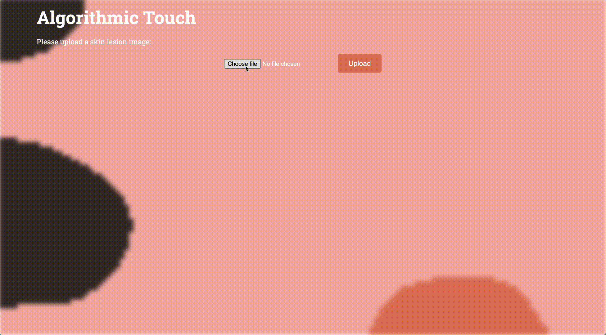

# Algorithmic Touch

> 基于深度学习的皮肤病图像识别与简笔画演示 Web 应用

## 项目简介

Algorithmic Touch 是一个基于 Flask 的 Web 应用，能够：

1. 接收用户上传的皮肤病照片  
2. 调用已微调的 ResNet34 模型进行分类预测，返回 7 类皮肤病的概率分布  
3. 将原图转换为简笔画风格，并在结果页面展示处理后的图像和疾病信息  

本项目将模型权重托管在 Hugging Face Hub，通过 `hf_hub_download` 动态获取；前端使用 p5.js 绘制柔和的背景动画，提升用户体验。

## Demo

<div align="center">
  


*左：上传界面；右：结果*

</div>

## 功能特性

- **模型推理**：7 类皮肤病（痤疮/玫瑰痤疮、基底细胞癌等恶性病变、湿疹、药疹、性病、黑色素瘤和痣、指甲真菌等）的概率输出  
- **简笔画效果**：基于 OpenCV 和噪声渲染，实现可配置的白线手绘效果  
- **背景动画**：使用 p5.js 生成低分辨率噪声着色并高斯模糊，适配移动端刘海屏全屏显示  
- **无大文件泄露**：模型权重通过 HF Hub 获取，不随代码仓库分发  


## 安装与运行

### 前置要求

- Python ≥ 3.8  
- Git  
- 可访问 Hugging Face Hub（网络环境）

### 克隆仓库

```bash
git clone https://github.com/littlexx15/Algorithmic-Touch.git
cd AlgorithmicTouch
```


### 安装依赖

```bash
python -m venv venv
source venv/bin/activate      # macOS/Linux
venv\Scripts\activate       # Windows
pip install --upgrade pip
pip install -r requirements.txt
```

### 配置环境变量

本项目使用 \`huggingface_hub\` 拉取模型权重，需要提供 HF_TOKEN：

Mac：

```bash
export HF_TOKEN="你的 Hugging Face 访问令牌"
```

Windows PowerShell：

```bash
$env:HF_TOKEN = "你的 Hugging Face 访问令牌"
```

### 启动服务

```bash
python app.py
```

默认监听 \`0.0.0.0:8000\`，打开浏览器访问：http://localhost:8000


